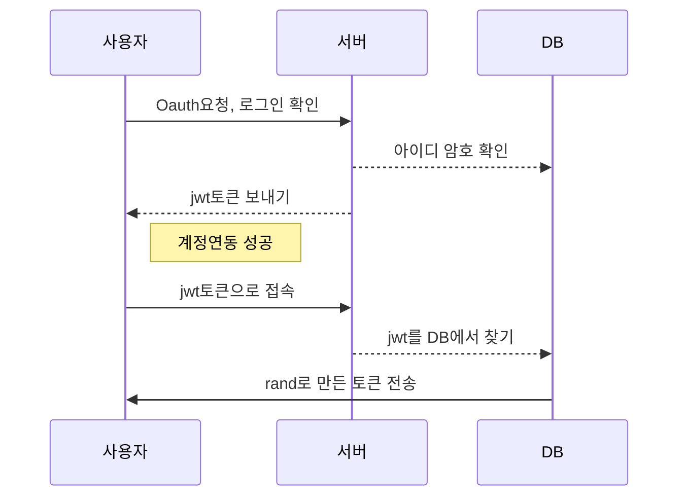

# 교통마스터

**교통마스터!** 는 SK NUGU 용으로 개발된 웹사이트와 챗봇입니다. 2019년 SK TELECOM NUGU 개발 공모전에서 **장려상**을 수상하였습니다.
**서울 버스 실시간 도착 정보**와 **서울, 부산, 인천의 전철 시간표**, 그리고 **서울 실시간 전철 도착** 정보와 비교 대조하여 최적의 정보를 전달합니다. 또한 **서울과 주요 광역시의 구**를 조회하여  **평균 혼잡도**를 조회와 **주유서 최저가** 조회가 가능합니다. Oauth를 사용하지만 몇가지 기능은 계정연동 없이 사용이 가능합니다.

OAUth2 authorization code 형식으로 구현을 하였습니다.  기존 코드를 이용했으며, 앱엔진을 하나로 쓰기 위해서 하나로 만들었습니다.

언어는 nodejs로 구현하였습니다. 원래는 java로 구현을 하려고 했으나 혼자서 웹과 챗봇 둘 다 개발을 해야 했기에 오류찾기 쉽고, 그 동안 챗봇을 만든 언어인 nodejs를 사용하게 되었습니다.

교통마스터의 개발기간은 30일 정도 였습니다.

최종적으로 장려상을 받았습니다. 언론기사는 [다음](https://news.v.daum.net/v/20190426092521429)과 같습니다.
* [SK텔레콤 '누구 플레이 개발 공모전' 최우수상 수상은 누구?](https://news.v.daum.net/v/20190426092521429)

* 이 코드에는 google oAuth와 개인 Oauth, data.go.kr의 토큰등이 빠져 있습니다.

## 사용 API

건강마스터의 사용 API는 다음과 같습니다.

* 기상청 현재날씨
* 서울시 버스 도착정보
* 수도권 실시간 전철 도착정보
* 수도권 전철 시간표 (서울, 경기, 인천)
* 부산 시간표
* Tmap 교통정보 : 혼잡도 정보를 평균으로 구현하였습니다.
* 주유소 최저가 정보

## 교통마스터 주요기능 ##

계정연동 없이 사용가능한 기능은 다음과 같습니다.

* 역 이름으로 25분내 도착가능한 열차 시간
* 역 이름으로 실시간 도착하는 전철
* 서울과 주요 광역시 구 교통혼잡정보
* 서울과 주요 광역시 최저가 주유소
* 역에서 역까지 걸리는 시간과 환승 정거장.

계정연동을 해야 사용한 기능은 다음과 같습니다. 역 정보와 상행선 하행선, 노선은 미리 저장되어 같은 기능이라도 사용이 더욱 편리합니다.

* 역 이름으로 도착가능한 열차 시간 (10~40분 지정 가능)
* 역 이름으로 실시간 도착하는 전철
* 서울 버스정류장 도착정보 : 퀄리티상 정류정 아이디는 숫자 만 자리인지라 계정 연동시 사용가능하게 하였습니다.
* 집, 회사, 기타 저장된 교통혼잡정보
* 날씨와 미세먼지 정보
* 최저가 주유소 정보
* 이메일로 최저가 주유소 리스트와 지도 받기
* 종합 정보 한거번에 듣기(지정한 버스 + 지정한 전철 시간표 역 + 지정한 지역 혼잡도)

## 클라우드 서버

개발서버는 **Google App Engine엔진**과 **Google mysql**을 사용했습니다. 이유는 구글 어시스턴트 개발때 주는 매달 200달러 쿠폰이 있어서 입니다.

## Oauth2 구조

본 서비스는  Oauth2 authorization code형태로 구현했으며, 현재 다음과 같은 구조로 토큰을 전송하고 있습니다.

* jwt로 생성하지만 다른 임의의 난수를 생성해도 됩니다.
* rand는 임의의 코드를 생성하는 모듈입니다. 여기서는 32자리로 생성했습니다.

자세한 사항은 [ietf](https://tools.ietf.org/html/rfc6749#section-4.1.1) 사이트를 참조하시면 됩니다.

## deploy

gcloud app deploy app.yaml
gcloud app deploy cron.yaml

## PPT

PT발표용 파일과 기획서 제출 파일입니다.

* [기획서](./pds/TheUmbrellaForAutumnRain_final_Plan.pptx)
* [10분 발표용 수정](./pds/TheUmbrellaForAutumnRain_final_Plan_speech_10min.pptx)

